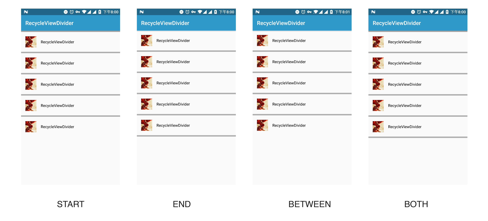
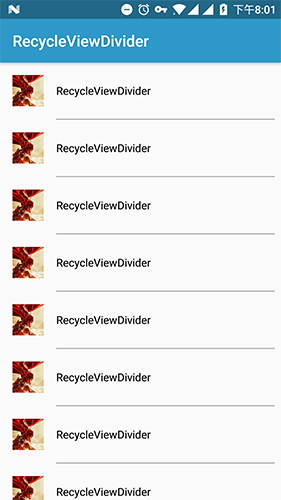
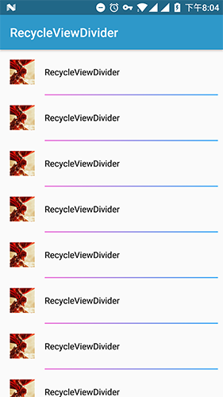
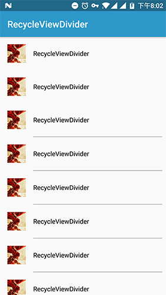

## RecyclerViewDivider

Setting divider for RecyclerView.


### Usage

1. Add the dependencies to your build.gradle file, RecyclerViewDivider is avaiable in JCenter:

   ```groovy
   compile 'com.jaeger.recyclerviewdivider:library:1.0.1'

   ```

2. Use `RecyclerViewDivider.Builder`

   ```java
   RecyclerViewDivider divider = new RecyclerViewDivider.Builder(this)
       .setStyle(RecyclerViewDivider.Style.BETWEEN)
       .setDrawableRes(R.drawable.divider)
       .setMarginLeft(72)
       .setMarginRight(8)
       .build();
   mRvList.addItemDecoration(divider);
   ```

### Feature

1. Style

   - START
   - END
   - BETWEEN
   - BOTH

   

2. Set margin

   ```java
    RecyclerViewDivider divider = new RecyclerViewDivider.Builder(this)
               .setOrientation(RecyclerViewDivider.VERTICAL)
               .setStyle(RecyclerViewDivider.Style.BETWEEN)
               .setColorRes(R.color.divider_gray)
               .setSize(1.5f)
               .setMarginLeft(72)
               .setMarginRight(8)
               .build();
   ```

   

3. Set drawable

   ```java
   RecyclerViewDivider divider = new RecyclerViewDivider.Builder(this)
       .setStyle(RecyclerViewDivider.Style.BETWEEN)
       .setDrawableRes(R.drawable.divider)
       .setMarginLeft(72)
       .setMarginRight(8)
       .build();
   mRvList.addItemDecoration(divider);
   ```

   

4. Set skip count 

   ```java
   RecyclerViewDivider divider = new RecyclerViewDivider.Builder(this)
       .setOrientation(RecyclerViewDivider.VERTICAL)
       .setStyle(RecyclerViewDivider.Style.BETWEEN)
       .setColorRes(R.color.divider_gray)
       .setSize(1.5f)
       .setStartSkipCount(2)
       .setMarginLeft(72)
       .setMarginRight(8)
       .build();
   ```

   
